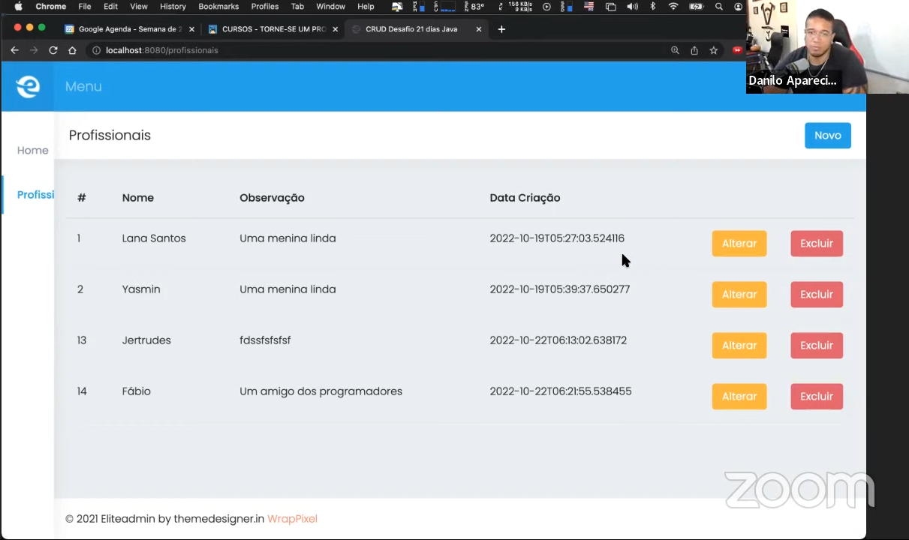

## Aula 20 - 22/10/2022 - [Desafio 21 dias em Java](../../README.md)

### Crud criado no desafio 21 dias de Java
> * ✅   Java 11;
> * ✅   Thymeleaf;
> * ✅   Aplicação Server Side Rendering (SSR);
> * ✅   ...;
> * ✅   Professor Danilo Aparecido - [🔗 Linkedin](https://www.linkedin.com/in/danilo-aparecido-dos-santos-03101034)

> ### Aplicação com telas de cadastro, edição, atualização e exclusão.
>
>
>Comunidade Torne-se um Programador, saiba mais
>[🔗 http://cursos.torneseumprogramador.com.br](http://cursos.torneseumprogramador.com.br/?ref=V71802991F)
> 
